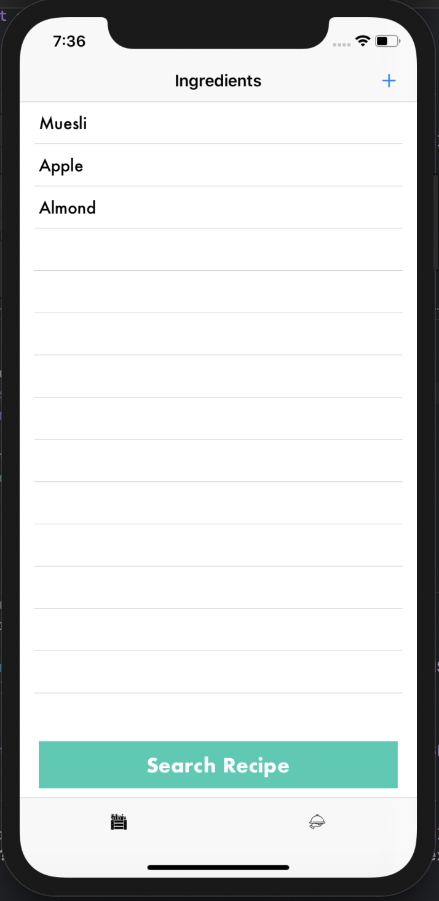
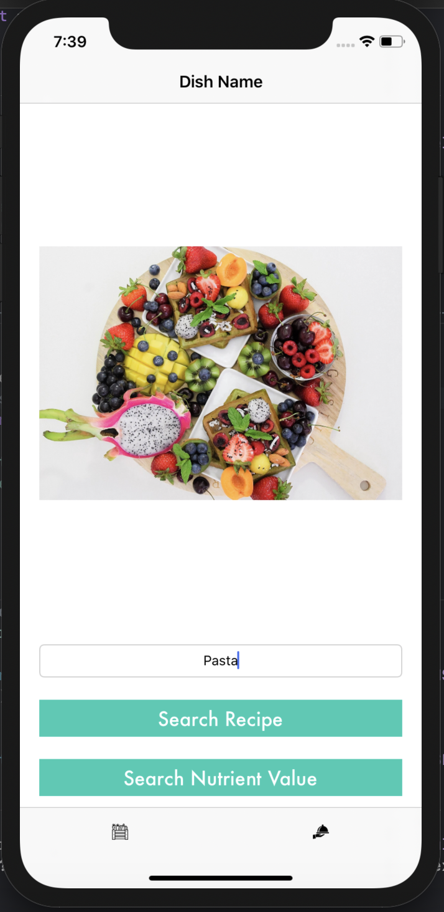
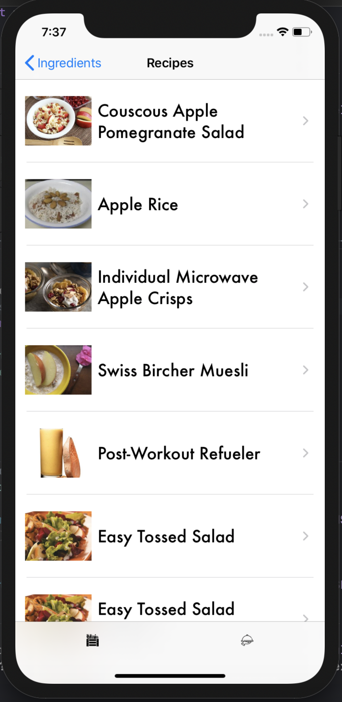
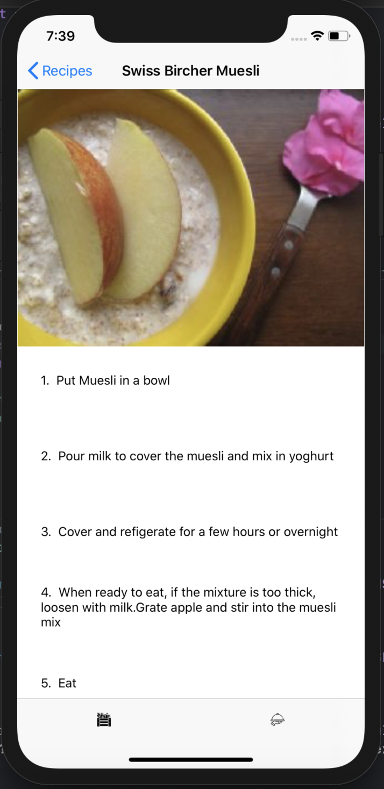
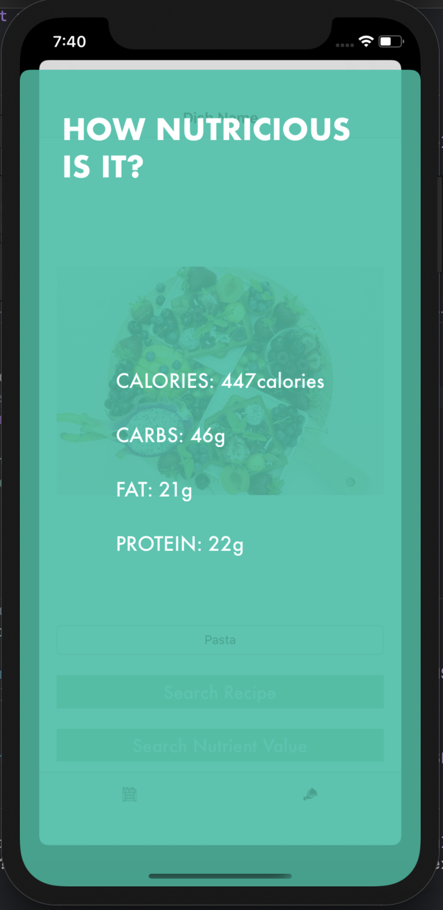

# WTFD 😋
What's There For Dinner - A Recipe App

 

## Introduction ##
Love having good food but do not know how to make it? This app has got you covered. This app uses Spoonacular's recipe API. It provide solutions to make any food-related vision a reality. This app can be used to search recipes based on the items you have readily available or wish to consume. Every household has a list of favourite ingredients readily available. Add it to the app only once and be ready to search and try new recipes each time. 😌  
You can also search for recipes and the nutrient values of a dish based on it's name. Once a recipe is selected the user gets a detailed explanation of how to make it. If you're health conscious and like to keep yourself updated about the nutrients you consume, go ahead and know more about what you consume. Spoonacular guesses nutrients based on multiple recipes and has an accuracy of 95%. ✨
 
 ## Steps to run 📲 ##
 * Clone or download the app from this repository. 👩‍💻
 * Open project file in terminal. 💻
 * Run `pod intall` to install all dependencies. 📥
 * Open the `WTFD.workspace` file. 💾
 * Change the bundle identifier. ⚙️
 * Press `Ctrl + R` to run the app. 📲
 * Do star this repo and/or contribute if you like it.🙂
 
 ## How to use  ##
 * After the launchscreen, you will be taken to the TabBarController where you will have two options - search for recipes from a list of ingredients or search recipes(or check nutritional value) by dish name.
 * In the first tab add and deleting ingredients from the list (ingredients you have at home). 
 * Search for recipes by using the search button at the bottom of the view.
 * For the second tab enter the name of the dish.
 * Click on search recipe to look for recipes.
 * Click on check nutrition to check nutrition value. 
 * When searching for recipe, click on the recipe to check it out. 
 * Make your favourite recipes with the steps mentioned. 🍽
 
 ## Libraries used in the project 📥 ##
 * UIKit
 * CoreData
 * Moya
 * SwiftyJSON
 
 ## App Screenshots 📸 ##
 

 
 
 
 
 
 
 

 ## License ⚖️ ##
 Please read the [LICENSE](../master/LICENSE) file for details.
 
 ## Author 👩‍💻 ##
 [Garima Bothra](https://github.com/garima94921)
 
 ## How to Contribute 🖋 ##
 * Run the app - Steps are mentioned above.
 * If you face issues in any step open a new issue.
 * To fix issues: Fork this repository, make your changes and make a Pull Request.

## Credits  ##

This app uses [Spoonacular API](https://spoonacular.com/food-api) for all food searches.
 
 
